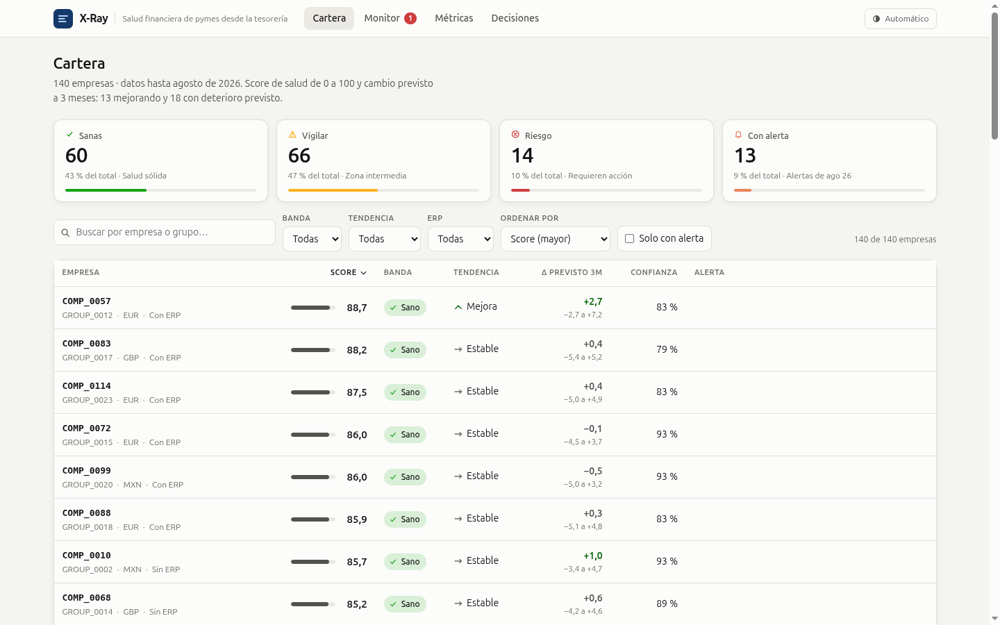

# X-Ray · salud financiera de pymes desde la tesorería

**HackSpain 2026 · reto de Embat** · 18–20 de septiembre, ETSIT UPM (Madrid)

Embat da el rastro financiero de 1.286 empresas sintéticas (250 grupos, de septiembre de 2024 a
septiembre de 2026): movimientos bancarios, facturas del ERP, deuda y un saldo final. A partir de
ahí este repositorio construye **un score de salud de 0 a 100 por empresa y mes**, su **trayectoria
prevista a 1-3 meses** con intervalos de confianza, un **monitor de alertas** y un **simulador de
escenarios**, todo servido por una API y una SPA que se abre delante del jurado.



La pieza central es `research/`. El resto del repositorio es el contexto que la justifica: el
enunciado, el marco de decisión del equipo, la capa que corrige la suciedad de los CSV y los
informes exploratorios.

## Las seis preguntas del reto

El enunciado ([`context/challenge.md`](context/challenge.md)) no pide predecir quiebras, sino leer
el comportamiento en las dos direcciones y antes de que sea evidente: quién está sano, quién mejora
(45→65), quién empieza a torcerse aunque aún parezca sano (82→68), si es un bache o una caída
estructural, qué señal se movió y cuándo, y con cuántos meses de antelación se vio venir.

El marco con el que respondemos está en [`context/scoring.md`](context/scoring.md): el score se
diseña como un prestamista con 100.000 € que decidir. La criticidad no es uniforme (una caja que se
evapora pesa mucho más que un DSO que se mueve un poco), y el resultado no es solo un número: para
cada empresa y mes hay nivel, trayectoria, explicación en lenguaje llano, bache frente a caída y una
acción (prestar / vigilar / no prestar).

## Estructura

| Ruta | Qué contiene |
|---|---|
| [`context/`](context) | Enunciado del reto (`challenge.md`) y el marco de scoring del equipo (`scoring.md`), cada uno con su versión HTML |
| [`data/`](data) | Los CSV originales del reto y su diccionario. **No se modifican nunca.** `invoices.csv` y `transactions.csv` van por Git LFS |
| [`src/mapping/`](src/mapping) | Capa de mapeo: vistas DuckDB que corrigen la suciedad al leer (países no ISO, ERP en dos vocabularios, deuda con signo invertido, saldos absurdos…). El inventario de fallos y su regla está en [`ISSUES.md`](src/mapping/ISSUES.md) |
| [`analysis/`](analysis) | Exploración del dataset. Informes autocontenidos que se abren sin servidor (`report.html`, `features_analisis_automatico.html`, `features_challenge.html`), la reconstrucción del histórico de caja (`cash_history.py`) y un explorador interactivo de esa caja en Streamlit (`app.py`) |
| [`scripts/`](scripts) | Utilidades del panel de caja: materializarlo en `analysis/cash.duckdb` (`build_cash_db.py`), validarlo contra el saldo ancla (`validate_cash.py`) y comprobar que sale idéntico en tres construcciones (`check_determinism.py`) |
| [`research/`](research) | **El sistema.** Panel mensual, score, previsión, monitor, simulador, API y demo. Tiene su propio [README](research/README.md) |
| [`frontend/`](frontend) | Frontend de producción en Nuxt 4 + Vue 3/TypeScript, con Vite, Nitro, Pinia, TanStack Query y el sistema visual de X-Ray |
| [`features.md`](features.md) | Brief de brainstorming de features: el reto, las trampas del dataset y las 17 features actuales con su peso |
| [`AGENTS.md`](AGENTS.md) | Contexto permanente para agentes de código, más `.agents/skills/` y `skills-lock.json` |

Dentro de `research/`:

| Ruta | Qué hace |
|---|---|
| `src/ingest.py`, `src/fx.py`, `src/panel.py` | CSV → parquet, tipos de cambio reales (BCE + currency-api) y panel empresa × mes con la caja reconstruida hacia atrás |
| `src/features.py`, `src/targets.py` | Las 17 features adimensionales del score y los eventos ancla (apagado, tensión de caja, declive, crecimiento) que sustituyen a las etiquetas que el dataset no trae |
| `src/xray.py` | API estilo scikit-learn: `HealthScorer` (nivel, aditivo y explicable al céntimo) y `TrajectoryForecaster` (LightGBM cuantílico q10/q50/q90 con calibración conformal) |
| `src/service.py`, `app/server.py` | El modelo como servicio: FastAPI según [`app/API_CONTRACT.md`](research/app/API_CONTRACT.md), con simulador de escenarios |
| `app/static/index.html` | La SPA de un solo fichero. Su lenguaje visual está fijado en [`app/DESIGN.md`](research/app/DESIGN.md) |
| `src/evaluate.py`, `src/anticipation.py` | Validación GroupKFold por `group_id` × 3 cortes y medición de antelación fuera de fold |
| `src/predict_submission.py` | Scoring del test oculto de 60-80 empresas nunca vistas |
| `DECISIONS.md`, `METRICS.md`, `reports/` | Las 27 decisiones con su porqué y su evidencia, la definición de cada métrica y los resultados por versión |
| `brainstorm/` | Propuestas de features de cuatro modelos sobre el mismo brief, con su [síntesis](research/brainstorm/SINTESIS.md) |

## Arranque rápido

Los datos grandes van por Git LFS, así que lo primero es traerlos (si `data/transactions.csv` pesa
134 bytes, es un puntero):

```bash
git lfs pull
```

El sistema y la demo se levantan desde `research/` con [uv](https://docs.astral.sh/uv/):

```bash
cd research
uv sync
uv run python src/ingest.py     # CSV -> data/*.parquet
uv run python src/fx.py         # tipos de cambio reales -> data/fx/
uv run python src/panel.py      # panel empresa x mes -> data/panel.parquet
uv run python src/service.py    # entrena el modelo -> artifacts/xray.joblib
uv run uvicorn app.server:app --port 8080   # abrir http://localhost:8080
```

Los comandos de validación, tests y scoring del test oculto están en el
[README de `research/`](research/README.md).

Los informes de `analysis/` ya están generados y se abren con doble clic. `analysis/` y `scripts/`
son la parte exploratoria y tienen sus propias dependencias en [`requirements.txt`](requirements.txt),
independientes de `research/` (en Windows, `.venv\Scripts\python.exe`):

```bash
python3 -m venv .venv && .venv/bin/pip install -r requirements.txt

.venv/bin/python analysis/generate_report.py        # -> analysis/report.html
.venv/bin/python analysis/feature_criticality.py    # -> analysis/features_analisis_automatico.html
.venv/bin/python scripts/build_cash_db.py           # panel de caja -> analysis/cash.duckdb (~30 s, no se commitea)
.venv/bin/python scripts/validate_cash.py           # cuadre del histórico contra el saldo de 2026-09-01
.venv/bin/python -m streamlit run analysis/app.py   # explorador interactivo de la caja (requiere streamlit)
```

`analysis/challenge_features.py` es la excepción: usa el mismo panel y las mismas features que el
score, así que se ejecuta desde el entorno de `research/`:

```bash
cd research && uv run python ../analysis/challenge_features.py   # -> analysis/features_challenge.html
```

El frontend moderno se ejecuta por separado y puede usar datos de desarrollo o conectarse a la API
FastAPI mediante `XRAY_API_BASE`:

```bash
cd frontend
npm install
npm run dev
```

La capa de mapeo se comprueba con sus propios tests (con fixtures, no necesitan el dataset) y con una
auditoría de la suciedad que queda sin corregir:

```bash
PYTHONPATH=src .venv/bin/python -m unittest discover -s src/mapping/tests -t src
PYTHONPATH=src .venv/bin/python -m mapping.audit
```

## Dónde está el resultado

La versión actual (v6, validación fuera de grupo, escala publicada 0-100) detecta caídas de ≥15
puntos a 3 meses con un AUC de 0,742 (0,703 el AR(1) de referencia) y de 0,574 en el quintil de
empresas que aún parecen sanas, donde el AR(1) no distingue nada (0,493). De 229 caídas
estructurales, el 48 % tuvo alerta antes de cruzar a riesgo, con una antelación mediana de 3 meses.
La tabla completa, las referencias y lo que **no** está resuelto (sobre todo bache frente a caída,
con un AUC de 0,53) están en el [README de `research/`](research/README.md) y en
[`research/METRICS.md`](research/METRICS.md).

Cada elección del sistema —por qué el score es por empresa y no por grupo, por qué los pesos salen
de una logística con signo restringido, por qué el suavizado es un EWMA con α = 0,5— está registrada
con su pregunta, su alternativa descartada y su evidencia en
[`research/DECISIONS.md`](research/DECISIONS.md) y en la pestaña «Decisiones» de la demo.
